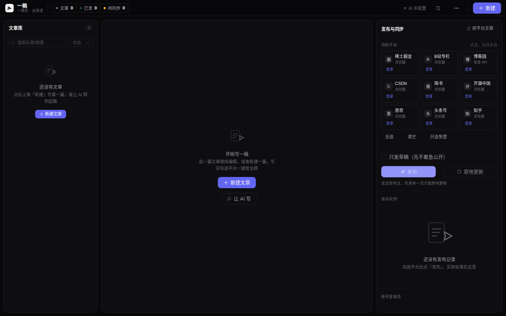
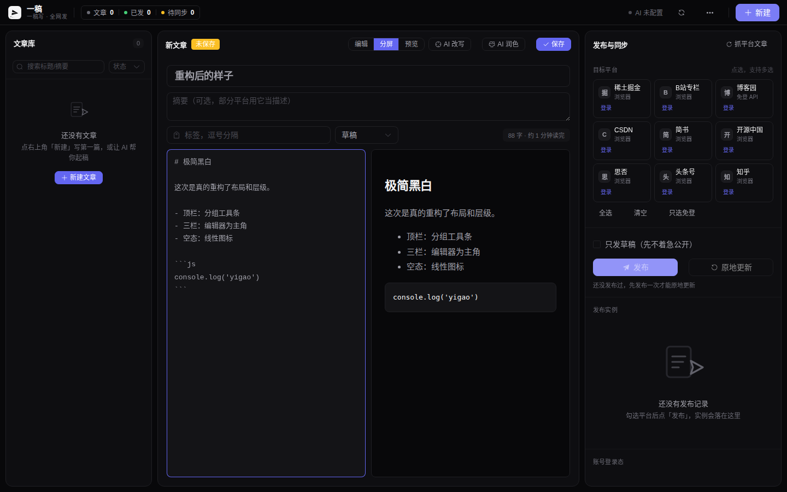
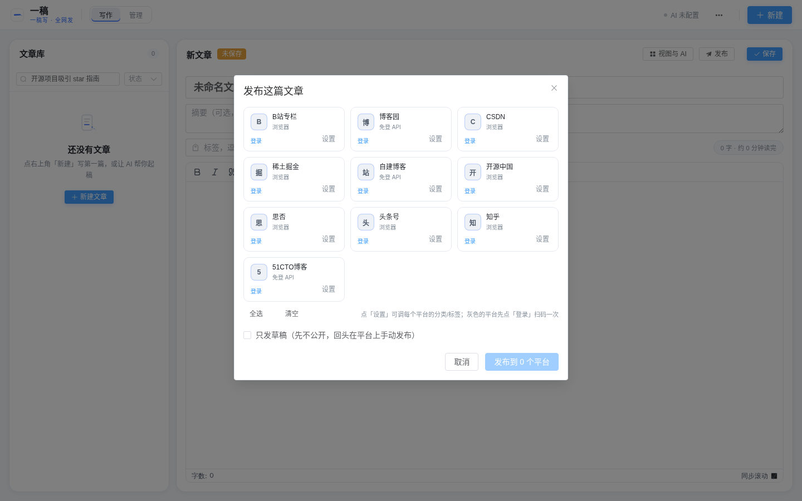

# 一稿 YiGao · AI 内容中台

> **一稿写，全网发。** 文章存在你自己的库里，AI 通过 API / MCP 全权管理：写、改、发、更新、看账号全部内容。
> 自带内置浏览器，扫码登录一次就长期在线，不依赖你日常的 Chrome / Edge 开着。

<p>
  
  
  
  
  
</p>



<table>
  <tr>
    <td width="50%"><br><sub>Markdown 编辑 / 分屏 / 预览三态，写完直接选平台发</sub></td>
    <td width="50%"><br><sub>一键多发，发布实例落库，可原地更新已发文章</sub></td>
  </tr>
</table>

## 30 秒看懂它能干什么

- **多平台一键分发**：一篇文章，勾选平台，同时发到 **9 个平台**（掘金 / CSDN / 博客园 / 知乎 / 简书 / 思否 / B站专栏 / 头条号 / 开源中国）。
- **原地更新，不是重发**：改了文章，它去打开各平台的**编辑页**改原文，URL 不变、评论点赞都在。
- **AI 全权接管**：内置 MCP Server + REST API，Claude 或任何脚本都能直接建文章、发布、抓取账号里的文章。
- **完全自托管**：文章库、登录态、浏览器 profile 全在你自己的机器上，不依赖任何第三方 SaaS。
- **自带 Web 管理界面**：暗色极简界面，响应式适配桌面 / 平板 / 手机。

## 快速开始

```bash
git clone https://gitcode.com/badhope/ai-content-hub.git
cd ai-content-hub
pip install -r requirements.txt
playwright install chromium

cp config.example.json config.json      # 填 AI key（可选，不填不影响发布功能）

# 扫码登录（有桌面的机器上跑一次，登录态长期有效）
python cli.py --headed login --platform juejin

# 起服务，打开 http://127.0.0.1:8800
python cli.py serve
```

## 支持平台（9 个）

| 平台 | 方式 | 发布 | 原地更新 | 抓取列表 | 备注 |
|---|---|---|---|---|---|
| 掘金 | 浏览器 + 页面 API | ✅ | ✅ | ✅ | |
| CSDN | 浏览器 | ✅ | ✅ | ✅ | |
| 博客园 | MetaWeblog 协议 | ✅ | ✅ | ✅ | **免浏览器、零验证码** |
| 知乎 | 浏览器 UI 注入 | ✅ | ✅ | — | 扫码登录；发布后自动抓文章 ID |
| 简书 | 作者后台 API | ✅ | ✅ | ✅ | cookie 即可，最稳 |
| 思否 SegmentFault | API 建稿 + UI 发布 | ✅ | ✅ | — | |
| B站专栏 | 创作 API（FormData） | ✅ 草稿 | ✅ 草稿 | — | 发表需到编辑页二次选分区 |
| 头条号 | 浏览器 UI 注入 | ✅ | — | — | 标题限 30 字 |
| 开源中国 | 浏览器 UI 注入 | ✅ | — | — | UEditor 富文本 |

> 知乎 / 头条 / 开源中国的发布选择器参考社区实测（MultiPost-Extension 等），平台改版后跑
> `python cli.py dump-dom --platform xxx` 重抓结构即可。扩一个新平台照着任一适配器抄 150 行。

## 这是什么 / 不是什么

- ✅ 是：**自托管**的多平台内容分发中台。文章库、发布、原地更新、AI 写稿，全部在你自己机器上。
- ✅ 是：给 AI 程序用的**内容 API**。MCP Server + REST API 双入口，Claude / 任意脚本都能直接调用。
- ❌ 不是：群发垃圾内容的工具。发布内置限速（平台间隔 8-20s、文章间隔 30-90s），请在平台规则内使用。

---

## 一、为什么不用浏览器插件方案

| | 插件方案（Wechatsync 等） | 本方案（内置浏览器） |
|---|---|---|
| 登录态 | 寄生在你日常浏览器里 | 独立 profile 存本地，程序自己管 |
| 浏览器关了 | 断，跑不了 | 后台常驻，定时任务照跑 |
| 编辑已发布文章 | ❌ 接口层面就没有 | ✅ 打开编辑页原地改 |
| AI 全权管理 | 只能"发" | 增删改查 + 列表 + 状态 |
| 做成独立程序 | 做不到，必须寄生 | 天然独立，能打包分发 |

代价：平台适配要自己写。目前 9 个平台已实现（见上方平台矩阵），
扩平台照着 150 行抄一个即可。文章可以由 AI 直接写（`core/ai.py`），接任何 OpenAI 兼容模型。

---

## 二、架构

```
        AI（Claude / 你的脚本）
             │  MCP 协议   或   REST API
             ▼
   ┌──────────────────────┐
   │      业务层 service   │
   ├──────────────────────┤
   │  文章库 articles      │  唯一真源，AI 写/改都在这儿
   │  发布实例 publications │  文章×平台，存 post_id / edit_url
   │  任务流水 jobs        │  谁什么时候发了什么，失败原因可查
   └──────────┬───────────┘
              │
     内置 Chromium（每平台一个持久化 profile）
              │
     适配器：掘金 / CSDN / 知乎 / 简书 / 思否 / B站 / 头条 / 开源中国 /（你的下一个平台）
              │
     发布    列表    原地更新
```

**原地更新靠三件事**：发布时把 `post_id` 和 `edit_url` 存进 `publications`；列表时从 DOM 抓 `edit_url`（不猜 URL）；改文章时自动把已发布实例标成 `pending`，`sync` 一把推平。

---

## 三、命令行用法

```bash
# 1) 扫码登录（会弹出浏览器窗口，扫一次就存住了）
python cli.py login --platform juejin
python cli.py login --platform csdn

# 2) 确认登录态
python cli.py check --platform juejin

# 3) 导入一篇文章
python cli.py import --path ./my-post.md

# 4) 发布
python cli.py publish --id 1 --platforms juejin,csdn

# 5) 改文章 → 自动同步到所有已发平台（原地更新，不是新发一篇）
python cli.py update --id 1
# 或者一把推平所有改动
python cli.py sync

# 看看账号里已有什么
python cli.py refresh --platform juejin
python cli.py status
```

## 四、Web 管理界面

启动服务后浏览器打开 `http://127.0.0.1:8800`。左边文章列表，中间编辑区，右边发布面板。

界面走**极简黑白**设计：中性灰阶打底、单一强调色、强字号层级，顶栏是分组工具条
（品牌 / 统计 / AI 状态 / 主操作），编辑器为绝对主角。

**前端技术栈**（`web/` 目录，独立工程）：

| 项 | 选型 | 为什么 |
|---|---|---|
| 框架 | Vue 3 `<script setup>` | 组合式 API，逻辑按功能聚在一处 |
| UI 库 | Element Plus（**按需引入**） | 只打包用到的组件，CSS 从 379KB 降到 148KB |
| 状态 | Pinia | 文章、发布实例、平台、统计分域管理 |
| 请求 | axios + 拦截器 | 统一错误提示，不用每个调用点写 try/catch |
| 渲染 | markdown-it | 编辑/分屏/预览三态，代码块和表格都对 |
| 构建 | Vite 6 | 秒级热更新，产物按 vue / element / md 分包 |

**响应式适配**（窗口一变自动重排，不是简单的媒体查询隐藏）：

| 宽度 | 布局 | 交互 |
|---|---|---|
| ≥1280 | 三栏常驻（列表+编辑+发布） | 全展开 |
| 1024–1280 | 两栏（列表+编辑） | 发布面板 → 右侧抽屉 + 浮动按钮 |
| 768–1024 | 两栏（列表+编辑） | 同上，工具条收紧 |
| <768 | 单栏（仅编辑区） | 列表 → 左侧抽屉；工具条换行，按钮只留图标 |

手机上还有个右下角浮动「发布」按钮，一点就开侧栏。

**开发 / 构建**：

```bash
cd web
pnpm install
pnpm dev        # 开发模式，:5173，自动代理 /api 到后端 :8800
pnpm build      # 构建到 server/static/，之后 python cli.py serve 一把梭带界面
```

改界面就改 `web/src/`，改完 `pnpm build`；不想装 Node 也行，
`server/static/` 里是构建好的产物，直接跑后端就能用。

---

## 五、让 AI 直接写

```bash
export AI_API_KEY=sk-xxx                       # 或写进 config.json
export AI_BASE_URL=https://api.deepseek.com/v1 # 通义/豆包/Kimi/智谱/本地 Ollama 都行
export AI_MODEL=deepseek-chat

python cli.py ai-write --topic "怎么用 AI 管内容中台" --words 2000
python cli.py ai-write --topic "Python 自动化" --publish juejin,cnblogs   # 写完直接发

python cli.py ai-rewrite --id 1 --instruction "改得更口语，补一个踩坑章节"
python cli.py ai-polish --id 1
```

AI 写完自动抽标题、生成摘要和 3-5 个标签，直接入库。改写/润色之后，
已发布的实例会自动标成待同步——`sync` 一把就推到各平台去。

> Windows 一样跑，把 `python` 换成你的 Python 路径即可。

---

## 六、AI 怎么用

### 方式 A：MCP（推荐，AI 客户端直连）

配到客户端配置里：

```json
{
  "mcpServers": {
    "content-hub": {
      "command": "python",
      "args": ["-m", "server.mcp_server"]
    }
  }
}
```

AI 拿到 **13 个工具**：

```
hub_status        中台总览
list_articles     列出文章
get_article       读全文
create_article    新建
edit_article      改文章（自动标记待同步）
publish_article   发布到指定平台
update_article    原地更新已发布的（不是新发一篇）
sync_pending      所有改动推平
refresh_platform  抓平台文章列表入库（AI 才看得见账号里有什么）
check_account     检查登录态
ai_write          AI 写一篇并入库，可顺手发布
ai_rewrite        AI 按指令改写（自动标记待同步）
ai_polish         AI 润色：修错别字、统一代码块语言、理顺结构
```

然后直接说人话：「写篇讲 XX 的文章发到掘金和 CSDN」「把 3 号文章标题改了同步到全部平台」「看看我账号里有哪些文章」。

### 方式 B：REST API

```bash
python cli.py serve        # http://127.0.0.1:8800/docs
```

| 方法 | 路径 | 作用 |
|---|---|---|
| GET | `/status` | 总览 |
| GET/POST | `/articles` | 列表 / 新建 |
| GET/PUT | `/articles/{id}` | 读 / 改 |
| POST | `/articles/{id}/publish` | 发布 |
| POST | `/articles/{id}/update` | **原地更新** |
| POST | `/sync/pending` | 推平所有改动 |
| POST | `/refresh/{platform}` | 抓账号文章入库 |
| POST | `/ai/write` | **AI 写一篇并入库** |
| POST | `/articles/{id}/ai-rewrite` | AI 改写 |
| POST | `/articles/{id}/ai-polish` | AI 润色 |
| GET | `/ai/status` | AI 配置好了没 |
| GET | `/accounts`、`/jobs` | 账号、任务流水 |
| POST | `/accounts/{platform}/login` | 扫码/过验证登录（`on_captcha=handoff\|abort`） |
| POST | `/accounts/{platform}/solve-captcha` | 就地处理验证码（半自动+人工） |
| GET | `/accounts/{platform}/diagnose` | 这平台怎么接、验证码怎么过 |
| GET | `/platforms` | 已实现的平台列表 |

> API 文档：`http://127.0.0.1:8800/docs`（FastAPI 自动生成，能直接点着调）

---

## 七、验证码与人机识别：三层策略

先把话说清楚：**"绕过验证码"这个说法本身是个坑**。

阿里云、极验、腾讯那类验证码，判定逻辑在服务端，前端 JS 加密后上报鼠标轨迹/环境指纹。
网上那些"破解"仓库（逆向滑块距离、训练模型识别缺口）的共同问题是：
平台一次风控升级就全部失效，而且账号被标记后**直接封**，代价远大于收益。

所以本项目的做法是三层递进——**想办法不遇到 > 遇到一次就永久解决 > 真遇到了交人工**：

### L1 能走官方通道就不模拟浏览器（最彻底）

有的平台开放了协议接口，压根不会有验证码。这是首选。

| 平台 | 通道 | 验证码 |
|---|---|---|
| 博客园 | MetaWeblog XML-RPC + 访问令牌 | **零验证码** |
| 掘金 | 有内容 OpenAPI（需申请） | 走 API 则零 |
| 简书 | 作者后台 API（cookie 即可，本项目已用） | 仅登录时 |
| B站专栏 | 创作 API（本项目已用，cookie+csrf） | 仅登录时 |
| 思否 | 草稿 API（本项目已用） | 仅登录时 |
| CSDN / 知乎 / 头条 / 开源中国 | 无公开发布 API，只能浏览器 | 走 L2/L3 |

```bash
python cli.py diagnose --platform cnblogs    # 看看这平台推荐怎么接
```

### L2 反检测 + 登录态持久化（降低触发率）

`core/browser.py` 里逐条抹平自动化痕迹：

| 指纹点 | 处理 |
|---|---|
| `navigator.webdriver` | 删除，并清掉原型链上的 |
| WebGL vendor/renderer | 伪装成 `Intel Inc. / Intel Iris OpenGL Engine`（否则暴露 SwiftShader） |
| 硬件参数 | `hardwareConcurrency`/`deviceMemory` 补成 8，无头下是 0 |
| 插件 / 语言 | 补 5 个插件、`zh-CN,zh,en`（无头下为空，一眼假） |
| `window.chrome` | 补上（真 Chrome 有，Playwright 没有） |
| `outerHeight` | 修正（无头下等于 inner，是破绽） |
| 启动参数 | `--disable-blink-features=AutomationControlled` 等 |
| 输入行为 | 逐字符输入 + 打错退格；鼠标走贝塞尔弧线 + 抖动 + 末段减速 |

配合 **登录态持久化**：一次登录存进 `data/profiles/<平台>_<账号>/`，
之后复用，把"过验证"从每天一次压到一次性。

### L3 半自动 + 人工交接（真弹了怎么办）

`core/humanize.py` + `CaptchaPolicy`：

1. **先半自动试一次** —— 纯复选框那种（"确认您不是机器人"）经常能过，
   用带轨迹的鼠标去点，而不是 `locator.click()`（后者零延迟，行为特征明显）。
   滑块会试着按变速轨迹拖过去。
2. **过不了就转人工** —— 此时浏览器窗口已经开着，你直接在里面点/拖/选。
   代码每 2 秒轮询一次，验证码消失就自动接着往下跑。同时会自动截图 +
   存 HTML 到 `data/captcha/`，方便你看现场。
3. **顺手再试** —— 人工等待期间每 20 秒重试一次半自动（有的验证码会刷新，重试能过）。

```bash
# 单独处理某平台的验证码
python cli.py solve-captcha --platform cnblogs --wait 180

# 登录时遇到验证码：默认就交人工
python cli.py login --platform juejin --on-captcha handoff
python cli.py login --platform juejin --on-captcha abort    # 无人值守时直接放弃
```

**实测记录**（本次沙箱）：博客园登录表单能正常填提交，提交后弹
**阿里云验证码**（"请完成安全验证 / 确认您不是机器人"，带 `CertifyId`）。
半自动点击复选框能点中，但服务端判定未通过 → 正确转入人工。
这正是预期结果：**服务端判定的验证码不应该被硬解，交人工才是对的**。

> 另外：博客园除了阿里云验证码，页面上还挂了 Google reCAPTCHA（走 `recaptcha.net` 国内镜像）。
> reCAPTCHA v3 是无感的（只打分不弹框），所以反检测做好能实实在在降低它的风控评分。

### 无人值守怎么办

验证码天然需要人。要真无人值守，只有两条路：

1. **优先用 L1**：能走协议的平台（博客园）就根本不碰验证码
2. **定期保活**：登录态是有有效期的。写个定时任务每周跑一次 `check`，
   掉线了发通知给你，你花 1 分钟手动补一次；而不是等发文章时才发现掉线

### 关于 xvfb（Linux 部署必看）

有头浏览器需要 X Server。服务器/容器里没有，程序会**自动拉一个 Xvfb**。
没装的话：

```bash
apt install -y xvfb
```

程序还会识别"僵尸 DISPLAY"——很多容器里被塞了 `DISPLAY=:0` 但根本没有 X 在监听，
盲信这个变量会让浏览器直接崩。代码会实际探测可用性，不行就换号段起 Xvfb。

---

## 八、博客园配置：浏览器登录 + 自动抠令牌（一条命令）

博客园发布走 MetaWeblog 协议最稳，但协议要三件套（endpoint / 登录用户名 / 访问令牌），
它们都锁在「设置 → 其他设置」里、**必须先登录才能看到**。
所以正确姿势不是"手贴令牌"，而是**拿账号密码浏览器登一次，自动抠出来**：

```bash
python cli.py --headed bootstrap-cnblogs \
    --username 你的登录名 --password 你的密码
```

它会：开有头浏览器 → 填账号密码 → **自动点阿里「智能验证」复选框** → 登录成功存盘
→ 打开设置页 → 把 endpoint / username / token 抠出来写进 `config.json`。
之后所有发布走纯协议，**再也不开浏览器、再也不碰验证码**。

### 登录页的验证码长什么样（别被绕）

博客园登录页叠了**两层**：

| 层 | 类型 | 能不能自动过 |
|---|---|---|
| 阿里「智能验证」 | 纯复选框（`#aliyunCaptcha-checkbox-icon`） | ✅ 拟人点一下即可，已实现 |
| Google reCAPTCHA | invisible 风险评分 | ⚠️ 环境干净时静默放行；风险分高时升级成**图片拼图**，脚本解不了 |

**关键：拼图那一下脚本过不去，但它是"一次性"的。** 登录态持久化在
`data/profiles/cnblogs_default/`，人工过完一次就一劳永逸。

### 如果自动登录被拦（弹图片拼图）

reCAPTCHA 的图片拼图是**给你看的**，用人工兜底：

```bash
python cli.py --headed login --platform cnblogs --on-captcha handoff
```

窗口会一直开着，你在里面把拼图点完，登录态自动存盘。**过这一次，后面全自动。**

> ⚠️ 别在短时间内反复试错登录——那会把 reCAPTCHA 风险分推高，
> 从"静默放行"直接变成"每次必弹拼图"。用对凭据一次过，或者干净环境重来。

### 关于「登录用户名」的一个真实坑

**数字用户 ID ≠ 登录用户名。** 比如账号站内数字 ID `1234567890` 这种，是账号在站内的数字标识
（个人主页 / 用户中心 URL 里的那串），**不是**你登录时填的用户名：
它既不是登录名，也不是 blogApp。被服务端拒时的表现是统一的 `用户名或密码错误`
（而不是"用户名不存在"），极具迷惑性。

登录名是注册时那个（邮箱 / 手机号 / 你自定义的用户名）。拿不准就去
`https://account.cnblogs.com/signin` 点「**忘记登录用户名**」找回。

## 九、两种适配器，挑着用

**浏览器型**（掘金、CSDN）：开内置 Chromium 操作编辑器，通用但慢，受页面改版影响。

**协议型**（博客园）：走 MetaWeblog XML-RPC，**不开浏览器**，稳定一个数量级，登录态不过期。
适配器里设 `needs_browser = False`，中台会自动跳过浏览器那一步。看到哪个平台有开放 API，
优先写协议型。

## 十、性能与稳定性

- **浏览器实例池**：无头浏览器按平台常驻复用（LRU 上限 4 个），第二次起发布不再付
  1~3 秒的启动开销；页面用完即关、实例保活，浏览器崩溃会自动重建重试一次。
  扫码登录前会自动释放该平台的池实例（profile 目录是独占的，不能两处同时开）。
- **SQLite WAL 模式** + 30s busy_timeout：多线程并发写不再偶发 `database is locked`。
- **内存零泄漏**：登录任务字典过期自动清理（完成 10 分钟后回收，上限 100 条）；
  jobs 流水表每次启动自动裁剪到最近 500 条。
- **可选 API 鉴权**：config.json 里设 `"api_token": "随机串"` 即启用，所有请求需带
  `X-API-Token` 头（默认关闭，本机使用不需要）。服务要暴露到局域网/公网时必须开启。

## 十一、测试：E2E 全模拟套件（不碰真号）

`tests/` 目录自带一套本地模拟平台（Flask mock，接口与页面元素和真实平台同构），
全流程验证适配器的**真实代码路径**——真实选择器、真实接口调用、真实跳转判定，
只是把目标域名换成 127.0.0.1，**不注册不登录不外发**：

```bash
# 掘金（协议型 API 链路）
python tests/mocks/mock_juejin.py &            # 模拟掘金 :9102
python tests/run_patched_server.py &           # Web 服务 :8800（适配器指向 mock）
python tests/e2e_login_flow.py                 # 登录→扫码→在线→建文档→发布→落库
python tests/e2e_screenshots.py [截图目录]      # 全程截图留证版

# 知乎（UI 编辑器注入链路：Draft.js 填标题 → HTML 粘贴 → 点发布 → /p/{id} 跳转）
python tests/mocks/mock_zhihu.py &
python tests/run_patched_server_zhihu.py &
python tests/e2e_zhihu.py                      # API 级 4 步冒烟
python tests/e2e_zhihu_screenshots.py [截图目录]
```

实测成绩（2026-09）：掘金截图版 **16/16**（REST 1~5ms、扫码到在线 7.9s、发布 0.6s、
刷新持久化 ✓）；知乎截图版 **9/9**（发布全流程 25.2s、post_id 落库 ✓）+ API 冒烟 **4/4**。
原理与边界（patch 方式、mock 扫码、测不到的真实风控）见 [tests/README.md](tests/README.md)。

## 十二、扩展新平台（照抄 150 行）

在 `core/adapters/` 新建 `xxx.py`，实现四个动作：

```python
@register
class XxxAdapter(PlatformAdapter):
    id = "xxx"
    login_url = "..."
    home_url  = "..."   # 登录后才能进的页，判登录态用
    list_url  = "..."
    new_url   = "..."

    def check_auth(self, page) -> bool: ...      # 登录了吗
    def list_articles(self, page, limit=50): ... # 返回 [{'post_id','title','url','edit_url','stats'}]
    def publish(self, page, article, options): ...  # 返回 {'post_id','post_url','edit_url'}
    def update(self, page, pub, article) -> bool: ... # 打开 edit_url 改内容保存
```

最后在 `core/service.py` 里 `from core.adapters import xxx` 导入一下即可注册。

**校准技巧**（必看）：平台改版导致选择器失效时，别瞎猜——

```python
from core.browser import dump_dom
dump_dom(page, "csdn_list")     # HTML 存到 data/debug/
```

打开存下来的 HTML 搜关键词，真实结构一目了然，比猜快十倍。
平台专属的 URL / API / 选择器全在各适配器顶部常量区，改版了只改那一块。

---

## 十三、当前状态与已知限制

**已跑通（沙箱实测）**：

| 能力 | 状态 |
|---|---|
| 数据层 / 业务层（文章库、发布实例、任务流水、改内容自动标待同步） | ✅ |
| AI 写稿（本地 mock 端到端：标题抽取、摘要、标签、改写、润色） | ✅ |
| REST API（25 个端点）+ MCP Server（13 个工具，Claude 直连） | ✅ |
| 内置浏览器 + 反检测（8 项指纹：webdriver 隐藏、WebGL 伪装等） | ✅ |
| Web 管理界面（极简黑白，真实浏览器点过建/改/存/预览/发布，无 JS 报错） | ✅ |
| Web UI 登录→发布全流程 E2E（掘金 16/16 · 知乎 9/9，每步截图留证） | ✅ |
| 响应式适配（≥1280 三栏 / 1024-1280 两栏+抽屉 / 平板 / 手机，实测无裁切） | ✅ |
| 验证码三层策略 + Xvfb 自动兜底 + 博客园自动抠 MetaWeblog 令牌 | ✅ |

> **需要真实账号跑一次才能定论**：发布、原地更新、列表依赖真实登录态，沙箱里没账号无法端到端验证。
> 掘金的 API 路径、CSDN 的编辑器选择器按公开结构编写，**第一次实跑可能需要微调**。
> 建议先 `python cli.py publish --id 1 --platforms juejin --draft` 只发草稿箱，确认无误再正式发。

**已知限制**：
- 平台风控：程序内置了平台间隔（8-20s）和文章间隔（30-90s）限速，别调太小
- CSDN 更新已发布文章会重新进审核
- 掘金标签（tag_ids）暂未实现，走的是无标签发布，需要的话可在适配器里加标签搜索接口
- 单账号模型，`account` 参数已预留但多账号并发未测
- **验证码做不到 100% 自动**：服务端判定的验证码（阿里云/极验/reCAPTCHA）本质上需要人。
  程序的设计目标是"尽量不遇到 + 遇到了一次性解决 + 真弹了交人工"，
  而不是硬解。要完全无人值守，走 L1 的协议通道（如博客园的 MetaWeblog）
- **首次登录必须在能看到浏览器的机器上做**：Linux 服务器上程序会自动起 Xvfb，
  但你在服务器上"扫码"不现实（看不到屏幕）。建议在有桌面的机器上登录一次，
  把 `data/profiles/` 整个拷到服务器复用

---

## 十四、目录结构

```
ai-content-hub/
├─ cli.py                  命令行入口（16 个命令）
├─ config.example.json     凭据模板（复制为 config.json）
├─ core/
│  ├─ db.py                数据层（SQLite）
│  ├─ browser.py           内置浏览器 + 登录态持久化 + 反检测 + 验证码策略
│  ├─ humanize.py          拟人化操作（变速输入、弧线鼠标、滑块拖动）
│  ├─ ai.py                AI 写稿（OpenAI 兼容协议）
│  ├─ service.py           业务层（AI 调的就是这个）
│  └─ adapters/
│     ├─ base.py           适配器接口 + 通用工具（HTML 粘贴/表单/cookie 工具）
│     ├─ juejin.py         掘金（浏览器 + 内容 API）
│     ├─ csdn.py           CSDN（浏览器）
│     ├─ cnblogs.py        博客园（免浏览器，MetaWeblog）
│     ├─ zhihu.py          知乎专栏（Draft.js 编辑器注入）
│     ├─ jianshu.py        简书（REST API）
│     ├─ segmentfault.py   思否（草稿 API + token 头）
│     ├─ bilibili.py       B站专栏（FormData + bili_jct）
│     ├─ toutiao.py        头条号（contenteditable 注入）
│     └─ oschina.py        开源中国（UEditor iframe）
├─ server/
│  ├─ static/              Web 界面构建产物（Vue 打包后落这儿）
│  ├─ api.py               REST API（25 个端点）
│  └─ mcp_server.py        MCP Server（AI 直连，13 个工具）
├─ web/                    前端工程（Vue3 + Element Plus + Vite）
│  ├─ src/
│  │  ├─ App.vue           布局骨架 + 响应式抽屉切换
│  │  ├─ api.js            接口封装
│  │  ├─ stores/hub.js     Pinia 状态
│  │  ├─ composables/      断点检测
│  │  ├─ components/       头部 / 列表 / 编辑器 / 发布面板 / AI 弹窗
│  │  └─ styles/main.scss  主题与响应式
│  ├─ vite.config.js       产物落到 ../server/static
│  └─ package.json
├─ tests/                  E2E 测试套件（mock 平台 + 截图流程，见 tests/README.md）
├─ docs/screenshots/       README 配图
└─ data/                   数据库 + 浏览器 profile + 验证码现场 + 调试 HTML
```

> `data/profiles/` 存的是登录态，`data/captcha/` 存的是验证码现场截图，
> **都别外传，别进 git**（`.gitignore` 已排除 `data/` 和 `config.json`）。

---

## 十五、参与贡献

欢迎 Issue / PR。改平台适配器前先跑一下 `python cli.py diagnose --platform xxx`，
选择器失效时用 `dump_dom()` 存现场比猜快十倍。

## 十六、AI 使用说明（透明度声明）

- 本项目的**产品设计、架构与代码由人工主导完成，AI 辅助编码与测试**；
- 项目自身的定位是"AI 辅助内容创作"工具：文章由 AI 起草、人审核后发布，
  请遵守各平台的 AI 内容规范，`ai_write` 产物入库时已带 `source=ai` 标记供你区分；
- 请勿将本工具用于批量灌水、刷量等违反平台规则的行为，账号风险自负。

## 仓库地址

四平台并列同步（同分支、同标签、同 HEAD），不分主次，任意选用：

| 平台 | 地址 |
|---|---|
| GitHub | <https://github.com/x33834/ai-content-hub> |
| GitHub | <https://github.com/Morningstar202604/ai-content-hub> |
| GitCode | <https://gitcode.com/badhope/ai-content-hub> |
| Gitee | <https://gitee.com/badhope/ai-content-hub> |

## 许可证

[MIT](LICENSE) © 2026 badhope
